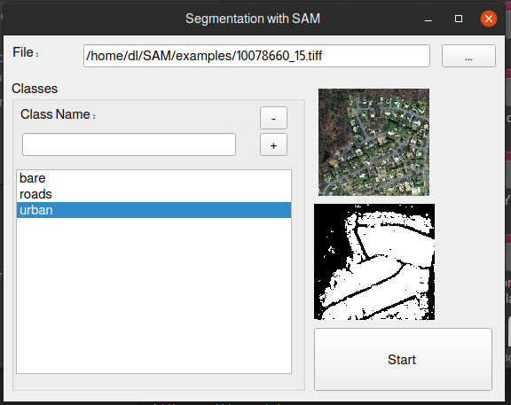

# Segmenter Segmentation Tool

The Segmentation Tool is a graphical user interface (GUI) tool developed using PyQt5 and based on the Facebook Segment Anything Model. It uses token points to semi-automate the process of image segmentation.

## Gallery

*Screenshot of the segmentation tool in action*

*Input image of bare landscape*

*Segmentation mask for the bare landscape*

*Input image of roads*

*Segmentation mask for the roads*

*Input image of urban area*

*Segmentation mask for the urban area*

## Usage
1. Open an image using the tool. Note that it may take some time to load.
2. Add and delete classes as needed.
3. Select the class that you want to segment and click "Start".
4. In the opened window:
   - Right-click to add points
   - Left-click to remove points
   - Middle-click to delete the nearest point
5. Once segmentation is complete, close the figure.
6. Click on the class name in the list again to view the results.
7. The results can be found in the "masks" folder.

## Requirements
The Segmentation Tool requires the following Python libraries to be installed:
- matplotlib
- pytorch
- torchvision
- PyQt5
- segment-anything

The Facebook Segment Anything Model and its pre-trained checkpoint can be downloaded from the following repository:
https://github.com/facebookresearch/segment-anything/

Make sure to use the "sam_vit_b_01ec64.pth" checkpoint for this tool.

## Resources
- Facebook Segment Anything Model repository: https://github.com/facebookresearch/segment-anything/
- Pre-trained checkpoint: models/sam_vit_b_01ec64.pth
